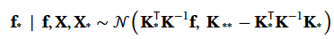

# GAUSSIAN PROCESSES REGRESSION

## Theoretical Basics
### Please refer to this link: 

## Some points to keep in mind
### A closed form solution for prediction in Gaussian Processes is:

### where K is the covariance matrix of (X_train, X_train). If this is singular, the optimization step in the training in search for the best hyperparameters will fail because a singular matrix is not invertible.
